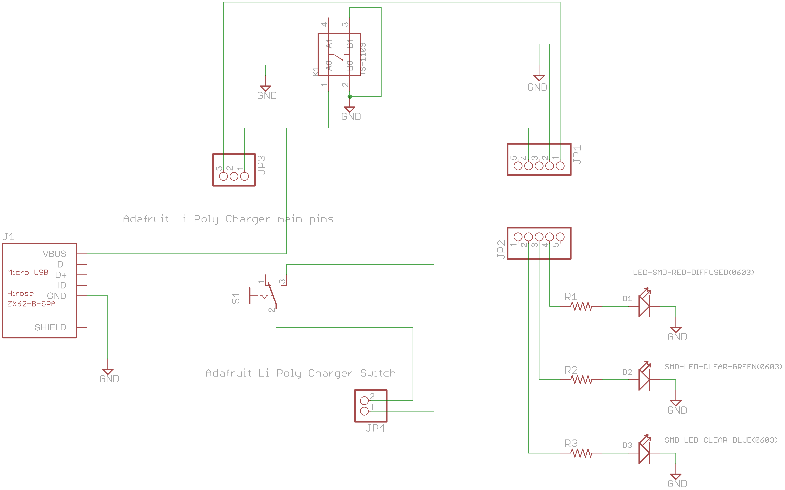

# tri-led-blinker

A "simple" blinking gift for somebody. Has On-Off switch and a button to change the order of blinking.

##Software

Arduino 1.6.4 IDE is used.

##Hardware

###PCB Design software and addons used

1. Eagle 7.3.0: I use Standard but Light should still be able to open/modify the files.
2. Seeed OPL libraries: Button, Connector, Diode (in pcb libraries folder)
2. Seeedstudio Design Rule Check for 2 layers (in repo as `SeeedStudio_2layer_DRU_no_angle_20140221.dru`)
3. Seeed Gerber Generater 2-layer board (in repo as `Seeed_Gerber_Generater_2-layer.cam`)

###Schematic drawings

Images are exported from Eagle at 600dpi.

The copper pour is connected to ground

###Parts required

1. JP1 and JP2: Pin header stand-in for [Adafruit Trinket 3V](https://www.adafruit.com/products/1500)
2. J1: SMD Micro-USB connector: Seeed OPL part 3400150P1
3. S1: [SPDT slide switch from Adafruit](https://www.adafruit.com/products/805). Others will work too
4. K1: Push button: Seeed OPL part 3110040P1
5. JP3 and JP4: Pin header stand-in for [Adafruit Pro Trinket LiIon/LiPoly Backpack Add-On](https://www.adafruit.com/products/2124)
6. D1: 0603 SMD Diffused-Red LED 1.7V-2.2V, 25mA: Seeed OPL part 0330020P1
7. D2: 0603 SMD Clear-Green LED 2.75V-3.95V , 25mA: Seeed OPL part 0330010P1
8. D2: 0603 SMD Clear-Blue LED 2.5V-3.1V , 25mA: Seeed OPL part 0330060P1
9. R1: Through-hole resistor 0.25W for red LED : Undetermined
10. R2: Through-hole resistor 0.25W for green LED : Undetermined
11. R3: Through-hole resistor 0.25W for blue LED : Undetermined

###PCB fabrication

PCB fabrication is currently done by [Seedestudio](https://www.seeedstudio.com/service/index.php?r=pcb) based on the following settings. Remember to consult the [order submission guidelines](http://support.seeedstudio.com/knowledgebase/articles/422482-fusion-pcb-order-submission-guidelines) before submitting. Use the provided Gerber generator to produce the Gerber files.

Seeedstudio requires the following gerber files to be zipped up for submission:

1. Top Layer: pcbname.GTL
2. Top Solder Mask: pcbname.GTS
3. Top Silkscreen: pcbname.GTO
4. Bottom Layer: pcbname.GBL
5. Bottom Solder Mask: pcbname.GBS
6. Bottom silkscreen: pcbname.GBO
7. Board Outline:pcbname.GML/GKO
8. Drills: pcbname.TXT
9. Inner Layer: pcbname.GL2(for 4 layer)
10. Inner Layer: pcbname.GL3(for 4 layer)

The zip file has been uploaded to the Releases section.

####My Fabrication Settings: 

1. Layer: 2
2. PCB Dimension: 5cm Max * 10cm Max
3. PCB Thickness: 1.2mm
4. PCB Qty: 10
5. PCB Color: Black (+US$20, expensive but I like Black)
6. Surface Finish: Hasl(Lead Free)
7. Copper weight: 1oz
8. Panalized PCBs: 1
9. Expedited Option: No
10. PCB Stencil: Unchecked

####PCB assembly:

Just use the provided `BOM File for Seeedstudio.csv`. I opted to do the assembly for only 5 pieces in case there are issues and I have to solder myself.

###Letters
I 3D-printed the letters based on the STL file obtained from [thingverse](http://www.thingiverse.com/thing:15198).
